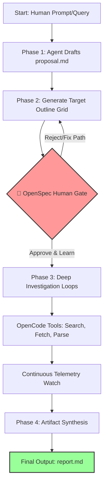

# Human Guided Deep Research Skill

A structured, artifact-driven AI research skill built specifically to drop directly into the `skills/` directory of **OpenCode** and **OpenSpec** environments. 

Unlike mainstream autonomous search engines, this skill enforces a transparent, step-by-step workflow designed not just to generate a report, but to **help the human operator learn, grow, and develop their own skills during the process.**

---

## 🧠 The Philosophy: Co-Learning over Blind Automation

In a world where commercial tools (like OpenAI Deep Research or Perplexity Pro) try to automate everything away, humans are left in the dark. 
* **The Problem with Black Boxes:** If an AI does 100% of the work in secret and just hands you a finished report, **the human learns nothing.** A static report cannot help an independent developer truly understand how to build or evolve their project. 
* **The Solution (Co-Learning):** This skill treats research as a collaborative partnership. By forcing human-gated checkpoints, you are forced to review the data, analyze the gaps, and think critically. **As the AI conducts research, you develop your own skills alongside it.**

---

## 🎯 Scope: When to Use vs. When to Skip

This is a specialized architectural skill, not a general-purpose chat interface. It excels at complex, layered data-gathering but adds unnecessary friction to trivial tasks.

### ✅ Perfect Use Cases (Suitable)
* **Market & Competitor Matrix Mapping:** Building a multi-column comparison chart of 10 different open-source projects or libraries.
* **Technological Discovery:** Deeply analyzing a new, unfamiliar API ecosystem, protocol specification, or runtime framework step-by-step.
* **Literature & Documentation Audits:** Sifting through extensive reference documentation to find edge cases, implementation patterns, or architectural standards.
* **Co-Learning Sandboxing:** When you actively want to understand the landscape *while* the AI acts as your mechanical researcher.

### ❌ Horrible Use Cases (NOT Suitable)
* **Simple Q&A / Trivia:** Asking single-answer facts (e.g., *"What is the capital of France?"*). It will force a massive workflow loop for a 3-word answer.
* **Creative Writing & Brainstorming:** Writing essays, brainstorming names, or drafting copy. This skill expects structured targets and data schemas.
* **Instant Code Fixes:** Debugging a quick terminal error. Forcing a research proposal layout will slow you down entirely.
* **Time-Critical Actions:** When you need a quick answer immediately. The human-in-the-loop gate intentionally stops execution to wait for you.

---

## 🔄 The Suspected Research Workflow

This skill strictly executes research across defined lifecycle phases to ensure alignment and active human engagement. 

### 📊 Workflow Topology


### 📦 Artifact Matrix Data Flow
```text
[ Initial Query ] 
       │
       ▼
 ┌───────────┐      ┌──────────────┐      ┌────────────────┐      ┌───────────┐
 │proposal.md│ ───> │   specs/     │ ───> │ /research-deep │ ───> │ report.md │
 └───────────┘      └──────────────└      └────────────────┘      └───────────┘
 (The Strategy)      (The Schema)          (Parallel Loops)        (Synthesis)
                          │
                    [ HUMAN INTERACTION ]
                    (Review & Upgrade Skill)

```
 1. **The Proposal (proposal.md):** The agent takes your initial query and breaks down a high-level research plan, defining the knowledge gaps it needs to fill.
 2. **The Outline Grid (specs/):** Before searching the live web, the agent generates a structured target schema of items and specific data fields. **The human operator reviews and refines this layout, learning the project's architecture early on.**
 3. **Deep Investigation Loops (/research-deep):** Using OpenCode runtime tools, parallel agents deep-dive into each approved item one-by-one, filling out the data grid while the human watches the live telemetry.
 4. **The Artifact Synthesis (report.md):** Compiles the granular findings into a single, comprehensive markdown document complete with source attributions for future human study.
## ⚡ How This Differs From Standard "Deep Research"
| Feature | Standard AI Deep Research | This Skill (OpenSpec + OpenCode) |
|---|---|---|
| **Human Role** | Passive consumer (just reads the final report). | Active co-learner (guides, reads, and grows mid-loop). |
| **Execution** | Fully autonomous, unmonitored black box. | Strict, phased workflow with human-gated checkins. |
| **Alignment** | AI guesses the research tree; can fall down rabbit holes. | Uses **OpenSpec Delta Specs** to approve the outline *before* execution. |
| **Environment** | Runs entirely in the cloud on third-party servers. | Runs locally inside your OpenCode agent workspace. |
## 🚀 How to Use & Install
### 1. Prerequisites (External Projects)
This skill cannot run standalone; it requires functioning installations of **OpenCode** and **OpenSpec**.
⚠️ **Important Notice on Compatibility:** OpenCode and OpenSpec are separate, rapidly evolving open-source projects. To avoid broken or outdated instructions here, **you must follow their official documentation for the latest installation and initialization steps:**
 * Ensure your local OpenCode environment is fully initialized.
 * Ensure your agent workspace is configured to read OpenSpec schemas.
### 2. Adding this Skill
Once your OpenCode environment is up and running, clone this repository and move the deep-research folder into your OpenCode skills directory:
```bash
# Clone the repository
git clone [https://github.com/alexleun/Human_in_the_loop_deep_reasearch_skill.git](https://github.com/alexleun/Human_in_the_loop_deep_reasearch_skill.git)

# Move the skill folder to your local OpenCode skills directory
# (Adjust the destination path depending on your specific OpenCode environment setup)
mv Human_in_the_loop_deep_reasearch_skill/deep-research/ ~/.config/opencode/skills/

```
### 3. Execution
After dropping the folder in, initialize your local agent workspace. The skill will automatically register via OpenSpec, allowing you to trigger the workflow through your configured OpenCode interface.
## 📁 Repository Structure
This repository contains only the standalone skill package:
 * deep-research/ - The core skill logic, commands, and workflow schemas to be placed inside your local OpenCode skills folder.
## 🛠️ Purpose & Motivation
This project is created and maintained by an **independent developer**.
 * **Built for Learning:** This repository is a personal sandbox born entirely out of an interest to experiment with, explore, and master the mechanics of OpenCode and OpenSpec.
 * **Skill Development:** It serves as a proof-of-concept that AI tools should be designed to upscale human intelligence, not replace it.
## ⚠️ Disclaimer & Risk
This project is an experimental trial and is shared publicly solely for educational and collaborative purposes.
> **Use at your own risk.** As an independent, experimental project, no guarantees or warranties are provided regarding its stability, security, API cost/token management, or performance. Because OpenCode and OpenSpec update frequently outside of this project, breaking changes may occur. Anyone adapting, modifying, or executing this skill in their own open-agent environments assumes full responsibility for any potential risks or outcomes.
> 
## 📄 License
This project is licensed under the MIT License - see the LICENSE file for details.
```

```
