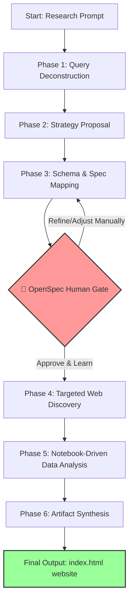

# Human Guided Deep Research Skill

A structured, artifact-driven AI research skill built specifically to drop directly into the `skills/` directory of **OpenCode** and **OpenSpec** environments. 

Unlike mainstream autonomous search engines, this skill enforces a transparent, step-by-step workflow designed not just to blindly automate a report, but to **help the human operator learn, grow, and develop their own skills during the process.**

---

## 🧠 The Philosophy: Co-Learning over Blind Automation

In a world where commercial tools (like OpenAI Deep Research or Perplexity Pro) try to automate everything away, humans are left in the dark. 
* **The Problem with Black Boxes:** If an AI does 100% of the work in secret and just hands you a finished file, **the human learns nothing.** A static report cannot help an independent developer truly understand how to build or evolve their project. 
* **The Solution (Co-Learning):** This skill treats research as a collaborative partnership. By forcing human-gated checkpoints, you are forced to review the data, analyze the gaps, and think critically. **As the AI conducts research, you develop your own skills alongside it.**

---

## 🧠 The Philosophy: Human Responsibility in the Age of Autonomous Agents

It is 2026, and the industry trend is hyper-focused on "Agent AI"—building fully autonomous, zero-human-in-the-loop systems designed to replace human workflows entirely. While this level of automation works for repetitive tasks, **deep research cannot and should not be fully outsourced to a black box.**

* **The Accountability Gap:** Autonomous agents can search, calculate, and compile, but they cannot hold responsibility. If an AI generates a flawed analysis, the AI suffers zero consequences. **The final accountability and liability always rest on the human developer.**
* **The Problem with Black Boxes:** If an AI does 100% of the work in secret and hands you a finished file, **the human learns nothing.** When human jobs and skills disappear behind automated screens, we stop growing. A static report cannot teach an independent developer how to truly lead their project.
* **The Solution (Co-Learning & Oversight):** This skill explicitly rejects the "zero-human" hype. It treats research as an augmented partnership. By forcing human-gated checkpoints, you retain absolute strategic control. You review the data, track the calculations in open Jupyter Notebooks, and **develop your own expertise alongside the machine.**


---

## 🎯 Scope: When to Use vs. When to Skip

This is a specialized architectural skill, not a general-purpose chat interface. It excels at complex, layered data-gathering but adds unnecessary friction to trivial tasks.

### ✅ Perfect Use Cases (Suitable)
* **Market & Competitor Matrix Mapping:** Building a multi-column comparison chart of 10 different open-source projects or libraries.
* **Technological Discovery:** Deeply analyzing a new, unfamiliar API ecosystem, protocol specification, or runtime framework step-by-step.
* **Literature & Documentation Audits:** Sifting through extensive reference documentation to find edge cases, implementation patterns, or architectural standards.
* **Co-Learning Sandboxing:** When you actively want to understand the landscape *while* the AI acts as your mechanical researcher.

### ❌ Horrible Use Cases (NOT Suitable)
* **Simple Q&A / Trivia:** Asking single-answer facts (e.g., *"What is the capital of France?"*). It will force a massive workflow loop for a 3-word answer.
* **Creative Writing & Brainstorming:** Writing essays, brainstorming names, or drafting copy. This skill expects structured targets and data schemas.
* **Instant Code Fixes:** Debugging a quick terminal error. Forcing a research proposal layout will slow you down entirely.
* **Time-Critical Actions:** When you need a quick answer immediately. The human-in-the-loop gate intentionally stops execution to wait for you.

---

## 🔄 The 6-Phase Research Workflow

This skill strictly executes research across six distinct, state-tracked lifecycle phases to maintain deep context alignment, optimize token efficiency, and guarantee human gatekeeping before deep execution loops begin.

### 📊 Workflow Topology


### 📦 Artifact Architecture & Data State Flow
```text
 [ User Query ] 
        │
        ▼
 ┌──────────────┐      ┌──────────────┐      ┌─────────────────┐      ┌────────────────┐
 │  proposal.md │ ───> │    specs/    │ ───> │ notebooks/*.ipynb│ ───> │  /dist/        │
 └──────────────┘      └──────────────┘      └─────────────────┘      └────────────────┘
  (The Strategy)        (The Schema)          (Trackable Labs)         (index.html Web)
                               │                      ▲                       ▲
                               ▼                      │                       │
                     [ HUMAN INTERACTION ] ───────────┴───────────────────────┘
                    (Verify & Learn Schema)       (Manual adjustments anytime)

```
### ⏱️ Detailed Phased Breakdown
 1. **Phase 1: Query Deconstruction & Intent Parsing** The skill ingests your initial research prompt, isolates core variables, identifies hidden knowledge gaps, and maps out the technical vocabulary required to search the topic effectively.
 2. **Phase 2: Strategy & Source Proposal (proposal.md)** Instead of searching blindly, the AI crafts a high-level research blueprint. It defines the target domains, search scopes, and investigation pathways it intends to pursue.
 3. **Phase 3: Schema & Outline Target Mapping (specs/)** The agent builds a structured target grid (rows, columns, and required data fields). **The skill halts execution here.** The human reviews, tweaks, and approves this layout—ensuring you understand the underlying architecture of your topic *before* data gathering starts.
 4. **Phase 4: Targeted Web Discovery & Knowledge Base Compilation (/knowledge-base/)** Once approved, parallel search agents deploy via your local OpenCode environment to index reference materials, documentation trees, and technical sources. All raw crawled findings are structured and safely saved into a local **Knowledge Base Folder** for absolute data ownership.
 5. **Phase 5: Notebook-Driven Data Analysis & Math (/notebooks/)** The gathered materials are parsed using fully transparent **Jupyter Notebooks (.ipynb)**. Using OpenCode runtimes, Python data scripts parse tables, extract metrics, and perform calculations. **Because it uses notebooks, you can inspect the code, track the calculation logic, and manually adjust the cells at any time.**
 6. **Phase 6: Artifact Synthesis & Website-Style Export (/output/index.html)** The final output is built as a beautifully structured, highly readable **website-style HTML document**. It can be opened directly in any web browser, presenting your deeply analyzed data, visual summaries, and complete source attributions in a production-ready interface.
## 🚀 How to Use & Install
### 1. Prerequisites (External Projects)
This skill cannot run standalone; it requires functioning installations of **OpenCode** and **OpenSpec**.
⚠️ **Important Notice on Compatibility:** OpenCode and OpenSpec are separate, rapidly evolving open-source projects. To avoid broken or outdated instructions here, **you must follow their official documentation for the latest installation and initialization steps:**
 * Ensure your local OpenCode environment is fully initialized.
 * Ensure your agent workspace is configured to read OpenSpec schemas.
### 2. Adding this Skill
Once your OpenCode environment is up and running, clone this repository and move the deep-research folder into your OpenCode skills directory:
```bash
# Clone the repository
git clone [https://github.com/alexleun/Human_in_the_loop_deep_reasearch_skill.git](https://github.com/alexleun/Human_in_the_loop_deep_reasearch_skill.git)

# Move the skill folder to your local OpenCode skills directory
mv Human_in_the_loop_deep_reasearch_skill/deep-research/ ~/.config/opencode/skills/

```
### 3. Execution
After dropping the folder in, initialize your local agent workspace. The skill will automatically register via OpenSpec, allowing you to trigger the workflow through your configured OpenCode interface.
## 📁 Repository Structure
This repository contains only the standalone skill package:
 * deep-research/ - The core skill logic, templates, commands, and workflow schemas to be placed inside your local OpenCode skills folder.
## 🛠️ Purpose & Motivation
This project is created and maintained by an **independent developer**.
 * **Built for Learning:** This repository is a personal sandbox born entirely out of an interest to experiment with, explore, and master the mechanics of OpenCode and OpenSpec.
 * **Skill Development:** It serves as a proof-of-concept that AI tools should be designed to upscale human intelligence, not replace it.
## ⚠️ Disclaimer & Risk
This project is an experimental trial and is shared publicly solely for educational and collaborative purposes.
> **Use at your own risk.** As an independent, experimental project, no guarantees or warranties are provided regarding its stability, security, API cost/token management, or performance. Because OpenCode and OpenSpec update frequently outside of this project, breaking changes may occur. Anyone adapting, modifying, or executing this skill in their own open-agent environments assumes full responsibility for any potential risks or outcomes.
> 
## 📄 License
This project is licensed under the MIT License - see the LICENSE file for details.
